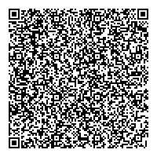
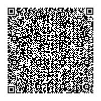

# Zent Scanner

## Tổng quan

Zent Scanner là ứng dụng di động hỗ trợ quá trình học tập tại trung tâm Zent. Sử dụng Zent Scanner để quét mã QR code và trả lời câu hỏi, câu hỏi có thể ở dạng trắc nghiệm hoặc tự luận.  
Ví dụ chúng ta có mã QR code sau:



Sau khi sử dụng ứng dụng Zent Scanner trên iOS hoặc Android để quét mã QR code trên, câu hỏi sẽ xuất hiện và học viên sẽ lựa chọn câu trả lời.


## Cấu trúc QR Code

Mã QR code trên được tạo ra bởi đoạn json sau:

```json
{
  "questionId": "abc1234xyz",
  "questionType": "singleChoice",
  "questionTitle": "Lịch sử",
  "questionMessage": "Đâu là tên gọi đầu tiên của nước Việt Nam?",
  "options": ["Xích Quỷ", "Văn Lang", "Âu Lạc", "Nam Việt", "Bộ Giao Chỉ"],
  "answers": ["Âu Lạc"],
  "answersSuccess": "Chúc mừng bạn đã trả lời đúng",
  "answersFail": "Bạn đã trả lời sai, vui lòng thử lại nhé",
  "requestUrl": "https://staging.zent.com"
}
```


| từ khoá | mô tả | yêu cầu |
| ----- | ----- | ----- |
| questionId | Mã định danh câu hỏi được Backend định nghĩa. Giá trị này sẽ được gửi lên server khi học viên trả lời câu hỏi | bắt buộc |
| questionType | Kiểu câu hỏi, chỉ được chọn 1 trong các giá trị sau: <br> `singleChoice`: Câu hỏi trắc nghiệm chỉ có 1 đáp án đúng <br> `multiChoice`: Câu hỏi trắc nghiệm có nhiều đáp án <br> `input`: Câu hỏi tự luận | bắt buộc |
| questionTitle | Tiêu đề ngắn ngọn của câu hỏi, thường là chủ đề của câu hỏi | tuỳ chọn |
| questionMessage | Nội dung câu hỏi | bắt buộc |
| imageUrl | Đường dẫn tới hình ảnh sẽ hiển thị ngay dưới nội dung câu hỏi | tuỳ chọn |
| options | Mảng các câu trả lời. Nếu là câu hỏi tự luận, vui lòng bỏ trống trường này | tuỳ chọn |
| answers | Mảng các câu trả lời đúng. <br> Mảng có 1 giá trị nếu là câu hỏi trắc nghiệm chỉ có 1 đáp án đúng. <br> Mảng có nhiều giá trị nếu là câu hỏi trắc nghiệm có nhiều đáp án đúng. <br> Nếu là câu hỏi tự luận, vui lòng bỏ qua trường này. | tuỳ chọn |
| answersSuccess | Nội dung sẽ xuất hiện khi học viên trả lời đúng câu hỏi trắc nghiệm hoặc hoàn thành câu hỏi tự luận | bắt buộc |
| answersFail | Nội dung sẽ xuất hiện khi học viên trả lời sai câu hỏi trắc nghiệm. Vui lòng bỏ qua trường này nếu là câu hỏi tự luận | tuỳ chọn |
| requestUrl | Ứng dụng sử dụng giá trị này để gửi kết quả lên server, nếu trường này trống, ứng dụng sẽ hiển thị `answersSuccess` ngay lập tức | tuỳ chọn |

## Gửi kết quả lên server

Sau khi học viên trả lời câu hỏi, nếu giá trị `requestUrl` được cung cấp, ứng dụng sẽ gửi 1 request lên server với nội dung:  
* url: `requestUrl`
* method: POST
* body:
```json
"userEmail": $userEmail,
"questionId": $questionId,
"answers": ["answer here", "and here"]
```

> Trong đó:
> `userEmail`: email mà học viên đã đăng nhập vào ứng dụng trên mobile.
> `questionId`: mã định danh câu hỏi lấy từ QR code.
> `answers` Mảng string các câu trả lời của học viên.
> Trường hợp câu hỏi trắc nghiệm chỉ có 1 đáp án đúng, mảng này chỉ có 1 giá trị.
> Trường hợp câu hỏi trắc nghiệm có nhiều đáp án đúng, mảng này có nhiều giá trị.
> Trường hợp câu hỏi tự luận, mảng này chỉ có 1 giá trị.

Sau khi phía server xử lý xong phải trả về HTTP Code như sau:
* 200: Đã xử lý câu trả lời thành công, mobile app sẽ hiện nội dung của `answersSuccess` lấy từ QR code.
* khác 200: mobile app sẽ hiện thông báo lỗi.

##  Mẫu QR code
Dưới đây là 1 số mẫu QR code dùng để thử nghiệm

#### Câu hỏi trắc nghiệm chỉ có 1 đáp án đúng



```json
{
  "questionId": "abc1234xyz",
  "questionType": "singleChoice",
  "questionTitle": "Lịch sử",
  "questionMessage": "Đâu là tên gọi đầu tiên của nước Việt Nam?",
  "options": ["Xích Quỷ", "Văn Lang", "Âu Lạc", "Nam Việt", "Bộ Giao Chỉ"],
  "answers": ["Âu Lạc"],
  "answersSuccess": "Chúc mừng bạn đã trả lời đúng",
  "answersFail": "Bạn đã trả lời sai, vui lòng thử lại nhé",
  "requestUrl": "https://stag.devmind.edu.vn/api/login",
}
```

#### Câu hỏi trắc nghiệm có nhiều đáp án đúng


```json
{
  "questionId": "abc1234xyz",
  "questionType": "multiChoice",
  "questionTitle": "Toán học",
  "questionMessage": "1 cộng với 1 bằng bao nhiêu?",
  "options": ["2", "3", "Bốn", "Hai", "Mười"],
  "answers": ["2", "Hai"],
  "answersSuccess": "Chúc mừng bạn đã trả lời đúng",
  "answersFail": "Bạn đã trả lời sai, vui lòng thử lại nhé",
  "requestUrl": "https://stag.devmind.edu.vn/api/login",
}
```

#### Câu hỏi tự luận


```json
{
"questionId": "abc1234xyz",
"questionType": "input",
"questionTitle": "Phản hồi",
"questionMessage": "Chúng tôi muốn lắng nghe ý kiến phản hồi của bạn về trung tâm để cải thiện và nâng cao chất lượng dịch vụ, bạn vui lòng dành ít phút để điền vào ô phía dưới nhé:",
"imageUrl": "https://larryferlazzo.edublogs.org/files/2020/03/feedback_1583238216.png",
"answersSuccess": "Cảm ơn bạn dành thời gian cho chúng tôi!",
"requestUrl": "https://stag.devmind.edu.vn/api/login"
}
```
