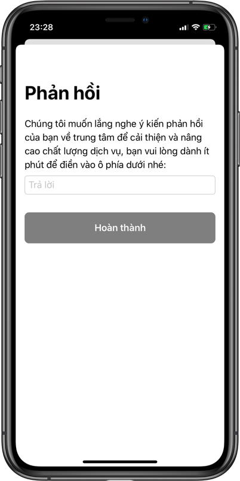

# JsonUI
An open-source platform that helps you render & interact the UI from Json quickly. For an example, we have a QR code look like this:


Then it would be decoded to **JsonUI** format:
```json
{
  "version": "1.0.0",
  "requestEndpoint": "https://staging.zentapi.com?formId=123456",
  "requestMethod": "POST",
  "requestHeader": {
    "content-type": "Application/JSON"
  },
  "requestBody": {
    "userId": "$userId",
    "answer": "$selectedValue"
  },
  "formTitle": "The title form",
  "formBody": [
    {
      "label": {
      "string": "How do you think about us?",
      "style": "title"
      }
    },
    {
      "label": {
        "string": "Please choose an interaction bellow to tell about us",
        "style": "body"
      }
    },
    {
      "image": {
        "url": "https://staging.zentapi.com/images?formId=123456"
      }
    },
    {
      "spacing": {
        "style": "normal"
      }
    },
    {
      "questionPicker": {
        "style": "singleChoice",
        "items": ["This is an answer A", "This is an answer B", "This is an answer C"],
        "itemCorrect": ["This is an answer A"],
        "titleCorrect": "Congratulations! Your anser is correct!",
        "titleWrong": "Opps! Please try again!",
        "doneButtonTitle": "Done"
      }
    }
  ]
}
```
By using JsonUI client apps (iOS & Android), after scanning the QR code above, we get the UI look like this:


